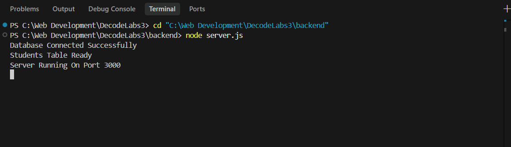
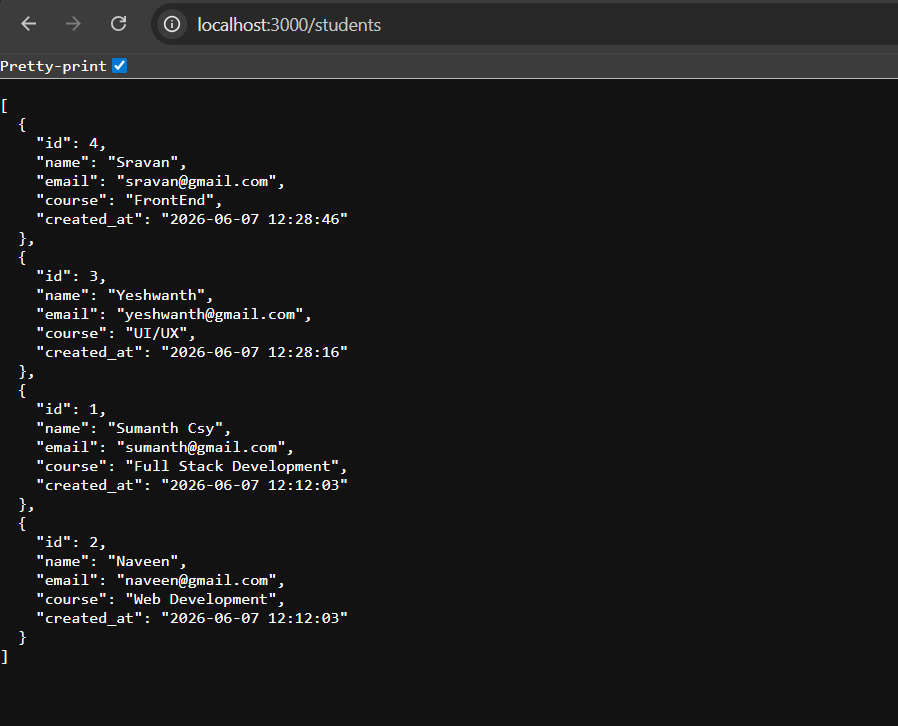
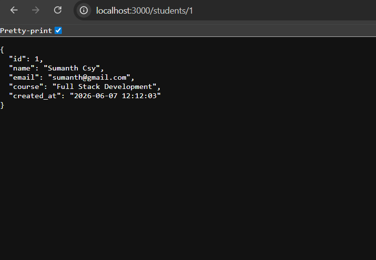
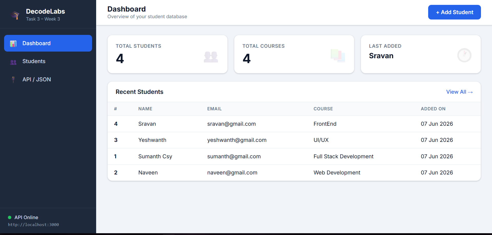
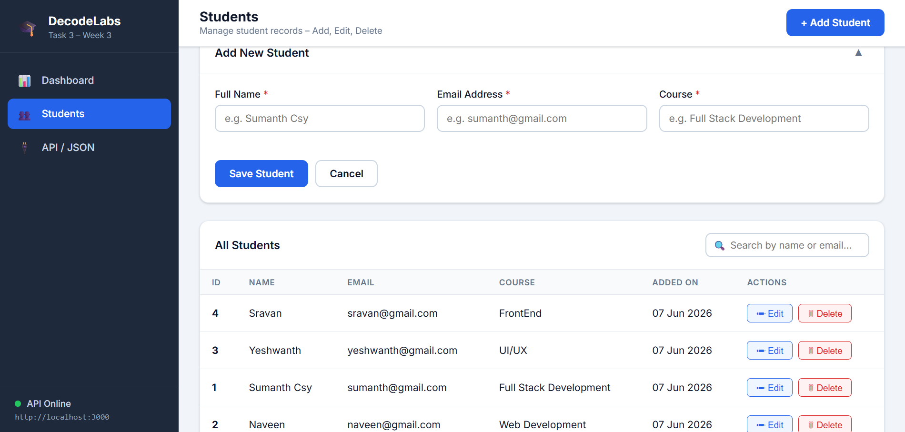
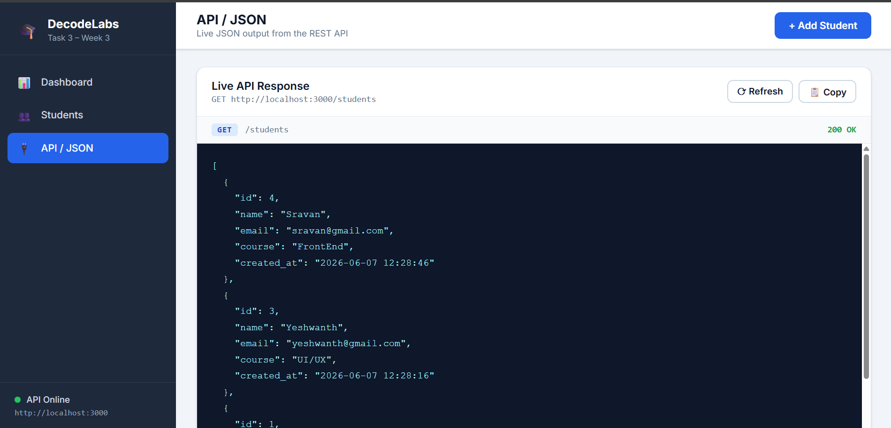
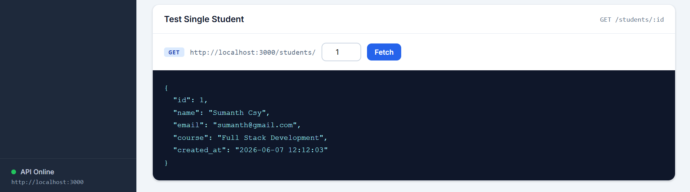

# Student Management System

A complete Full Stack CRUD application built with **Node.js**, **Express.js**, **SQLite3**, **HTML**, **CSS**, and **Vanilla JavaScript**. Designed for internship Week 3 submission.

---

## Quick Setup & Run

### Step 1 — Install Dependencies

```bash
cd "C:\Web Development\DecodeLabs3\backend"
npm install
```

### Step 2 — Start the Backend

```bash
cd "C:\Web Development\DecodeLabs3\backend"
node server.js
```

Expected output:
```
Database Connected Successfully
Students Table Ready
Server Running On Port 3000
```

> Keep this terminal running. The frontend needs the backend to be live.

### Step 3 — Open the Frontend

```bash
start "C:\Web Development\DecodeLabs3\frontend\index.html"
```

Or simply double-click `frontend/index.html` in File Explorer.

### Kill the Server (when done)

```bash
taskkill /F /IM node.exe
```

---

## Project Structure

```text
DecodeLabs3/
│
├── backend/                        # Pure REST API (Node.js + Express + SQLite)
│   ├── server.js                   # Entry point – starts server on port 3000
│   ├── package.json
│   ├── .gitignore
│   ├── config/
│   │   └── database.js             # SQLite connection, table setup, seed data
│   ├── models/
│   │   └── studentModel.js         # Raw SQL queries (CRUD)
│   ├── controllers/
│   │   └── studentController.js    # Request handlers and validation
│   ├── routes/
│   │   └── studentRoutes.js        # API route definitions
│   └── database/
│       └── students.db             # Auto-created SQLite file
│
└── frontend/                       # Standalone HTML dashboard
    ├── index.html                  # Dashboard UI
    ├── style.css                   # Professional styling
    └── script.js                   # All client-side logic
```

---

## How to Run

### Step 1 – Start the Backend

```bash
cd backend
npm install
node server.js
```

Expected output:
```
Database Connected Successfully
Students Table Ready
Server Running On Port 3000
```

### Step 2 – Open the Frontend

Just double-click `frontend/index.html` in your file explorer  
**or** drag it into your browser.

> The frontend uses `fetch('http://localhost:3000/students')` so the backend must be running first.

---

## API Endpoints

| Method   | Endpoint          | Description          | Status Codes           |
|----------|-------------------|----------------------|------------------------|
| GET      | /students         | Get all students     | 200                    |
| GET      | /students/:id     | Get student by ID    | 200, 404               |
| POST     | /students         | Add new student      | 201, 400               |
| PUT      | /students/:id     | Update student       | 200, 400, 404          |
| DELETE   | /students/:id     | Delete student       | 200, 404               |

---

## Database Schema

| Column     | Type      | Constraint            |
|------------|-----------|-----------------------|
| id         | INTEGER   | PRIMARY KEY, AUTO     |
| name       | TEXT      | NOT NULL              |
| email      | TEXT      | UNIQUE, NOT NULL      |
| course     | TEXT      | NOT NULL              |
| created_at | TIMESTAMP | DEFAULT CURRENT_TIME  |

---

## Frontend Features

| Feature              | Description                                             |
|----------------------|---------------------------------------------------------|
| Dashboard            | Total students, courses, last added student stats       |
| Student Table        | Full CRUD with Edit and Delete buttons per row          |
| Add / Edit Form      | Inline form with real-time field validation             |
| Search               | Filter by name, email, or course instantly              |
| Delete Confirmation  | Modal popup before deletion                             |
| JSON Viewer          | Live formatted GET /students response                   |
| API Tester           | Fetch any student by ID and see raw JSON                |
| API Status           | Live indicator showing if backend is online/offline     |

---

## Sample API Responses

### GET /students
```json
[
  {
    "id": 1,
    "name": "Sumanth Csy",
    "email": "sumanth@gmail.com",
    "course": "Full Stack Development",
    "created_at": "2026-06-07 11:13:21"
  },
  {
    "id": 2,
    "name": "Prasanna Gundaveni",
    "email": "prasanna@gmail.com",
    "course": "Web Development",
    "created_at": "2026-06-07 11:13:21"
  }
]
```

### POST /students – Success
```json
{ "success": true, "message": "Student Added Successfully" }
```

### POST /students – Missing Fields
```json
{ "success": false, "message": "Name, Email and Course are required" }
```

### DELETE /students/1 – Success
```json
{ "success": true, "message": "Student Deleted Successfully" }
```

---

## Screenshots

### 1. Backend Server Startup & API
#### Server Startup Logs


#### GET /students API Response (All Students)


#### GET /students/:id API Response (Single Student)


---

### 2. Frontend Dashboard UI
#### Dashboard Overview & Students List


#### Add Student Modal Form


#### Live JSON Response Panel


#### Single Student API Tester


---

> **By @Sumanth Csy**
